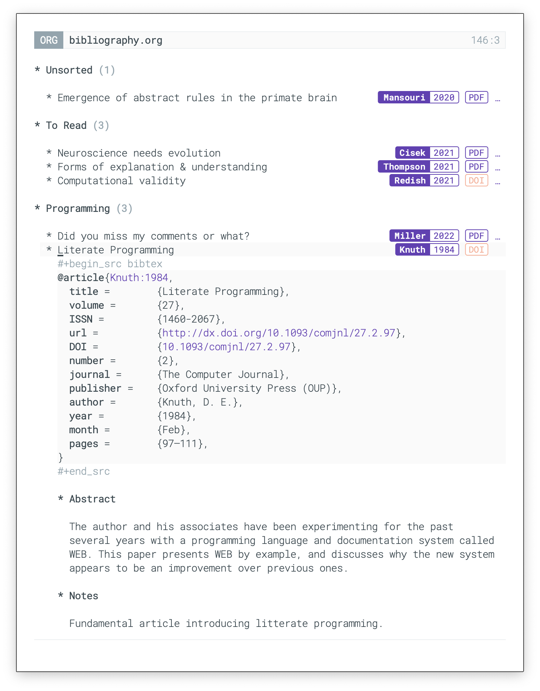

## org-bib-mode

A minor mode for literate and annotated bibliography heavily inspired from the post [Managing my Annotated Bibliography with Emacs' Org Mode](http://cachestocaches.com/2020/3/org-mode-annotated-bibliography/) by [Gregory J Stein](http://gjstein.com/). Drag and drop with a PDF file is supposed to work if the PDF contains a DOI.

